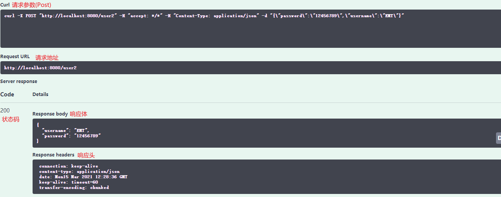

# Swagger 学习

> 学习目标

1. 了解 Swagger 的作用和概念
2. 了解前后端分离
3. 在 SpringBoot 中集成 Swagger 

# Swagger 简介

## 前后端分离

主流的技术栈：Vue + SpringBoot

后端时代：前端只用管理静态页面(html、css) & 后端需要将其修改为 JSP 等模板引擎进行视图数据渲染

前后端分离时代：

- 后端：三层架构(Controller、Service、Dao)
- 前端：前端控制层(VM)、视图层(View)
  - 使用技术：伪造后端数据(JSON), 可以不需要通过后端独立启动前端项目
- 优点：
  1. 前后端相对独立，**松耦合**
  2. 前后端也可以部署在不同的服务器上
- **问题：** 前后端集成联调，前端人员和后端人员无法做到 `及时协商，尽早解决`。可能会导致问题集中爆发
- 解决方案
  - 首先指定 **schema** [计划提纲]。实时更新最新的 API，降低集成的风险(早些年会使用 Word)
  - 前后端分离 - Swagger
    - 前端测试后端接口：postman
    - 后端提供接口：需要实时更新接口的数据的变动 

## Swagger

- 世界上最流行的 API 框架
- RestFul Api 文档在线自动生成工具(可以实现 **Api 文档与 Api 定义同步更新**)
- 可以直接运行，且可以在线测试 API 接口
- 支持多种语言(java、php)
- 官网：https://swagger.io/   文档：https://swagger.io/docs/

# SpringBoot 中集成 Swagger

1. 导入需要的 Maven 依赖

   ```xml
   <dependency>
       <groupId>io.springfox</groupId>
       <artifactId>springfox-boot-starter</artifactId>
       <version>3.0.0</version>
   </dependency>
   ```

2. 创建 SpringBoot 项目编写 Hello 工程

3. 在启动类上添加 `@EnableOpenApi` 注解开启 Swagger

   ```java
   @EnableOpenApi
   @SpringBootApplication
   public class SwaggerApplication {
   
       public static void main(String[] args) {
           SpringApplication.run(SwaggerApplication.class, args);
       }
   
   }
   ```

4. 启动项目并访问：http://localhost:8080/swagger-ui/index.html

5. 查看页面信息

   

# 配置 Swagger

## 基本配置

```java
@Configuration
public class SwaggerConfig {

    /**
     * 配置 Swagger
     * @param env
     * @return
     */
    @Bean
    public Docket docket(Environment env){
        return new Docket(DocumentationType.OAS_30)
            .apiInfo(apiInfo()); // 设置 Api 文档信息
    }

    /**
     * 配置 Api 文档信息
     * @return
     */
    private ApiInfo apiInfo() {
        return new ApiInfo(
            "Dreamer07 Swagger 测试" // 标题
            , "巴御前天地第一" // 描述
            , "1.0" // 版本
            , "http://www.baidu.com" // 网址?
            , new Contact("Dreamer07", "http://www.baidu.com", "2391105059@qq.com") // 配置作者信息
            , "Apache 2.0"
            , "http://www.apache.org/licenses/LICENSE-2.0"
            , new ArrayList()
        );
    }
}
```

## 配置 Swagger 扫描接口 - Docket.select()

```java
return new Docket(DocumentationType.OAS_30)
    .apiInfo(apiInfo()) // 设置 Api 文档信息
    /*
    * Docket.select(): 配置 Swagger 扫描接口
    *   apis(): 配置要扫描的接口
    *       - 需要传入一个 Predicate<RequestHandler> 类实例，
    *         但我们可以通过 RequestHandlerSelectors 的静态方法创建
    *       - RequestHandlerSelectors 可选值
    *           #basePackage(): 传入要扫描的包路径
    *           #any()：所有
    *           #none(): 不扫描
    *           #withMethodAnnotation(): 传入注解类，只有具有该注解的方法才会被扫描
    *           #withClassAnnotation()：传入注解类，只有具有该注解的类才会被扫描
    *   paths()：根据访问路径筛选
    *       - 需要传入一个 Predicate<String> 类实例，但可以通过 PathSelectors 的静态方法创建
    *       - PathSelectors 可选值
    *           #any & #none ~
    *           #regex() 根据正则规则, 留下符合规则的接口
    *           #ant() 根据 ant 风格的匹配规则，只留下符合规则的接口
    * */
    .select()
    .apis(RequestHandlerSelectors.withClassAnnotation(RestController.class))
    .paths(PathSelectors.ant("/byq/**"))
    .build();
```

## 配置开启 Swagger - Docket().enable()

```java
/**
     * 配置 Swagger
     * @param env 当前项目的运行环境对象
     * @return
     */
@Bean
public Docket docket(Environment env){

    // 检查当前环境是否为指定的环境变量
    Profiles profile = Profiles.of("dev", "test");
    // 判断是否处在指定的环境中
    boolean flag = env.acceptsProfiles(profile);

    return new Docket(DocumentationType.OAS_30)
        .enable(flag)
       	....
}
```

## 配置多个分组 - Docket.groupName()

> 可以配置多个 Docket，如何配置不同的 groupName 用来区分

```java
@Bean
public Docket docket01(){
    return new Docket(DocumentationType.SWAGGER_2).groupName("A");
}
@Bean
public Docket docket02(){
    return new Docket(DocumentationType.SWAGGER_2).groupName("B");
}
@Bean
public Docket docket03(){
    return new Docket(DocumentationType.SWAGGER_2).groupName("C");
}
```


# Swagger 文档注解

> 注解说明

```dart
- @Api()用于类； 
表示标识这个类是swagger的资源 
- @ApiOperation()用于方法； 
表示一个http请求的操作 
- @ApiParam()用于方法，参数，字段说明； 
表示对参数的添加元数据（说明或是否必填等） 
- @ApiModel()用于类 
表示对类进行说明，用于参数用实体类接收 
- @ApiModelProperty()用于方法，字段 
表示对model属性的说明或者数据操作更改 
- @ApiIgnore()用于类，方法，方法参数 
表示这个方法或者类被忽略 
```

> 测试

```java
@ApiModel(description = "用戶实体类") // 对于 ApiModel 建议使用 description 属性，而不是直接修改 value
@NoArgsConstructor
@AllArgsConstructor
@Data
public class User {

    @ApiModelProperty("用户名")
    private String username;

    @ApiModelProperty("密码")
    private String password;

}
```

```java
@Api("用户请求接口")
@RestController
public class HelloController {

    @GetMapping("/hello")
    public String hello(){
        return "hello";
    }

    /* 标注了 @ApiModel(@ApiModelProperty) 的注解的实体类，只有作为 响应数据/请求数据 出现时才会被扫描  */
    @GetMapping("/user")
    public User getUser(){
        return new User("阿巴巴", "1237");
    }
    @PostMapping("/user2")
    public User postUser(@RequestBody User user){
        return user;
    }

    @ApiOperation("获取 hello2")
    @GetMapping("/hello2")
    public String hello2(@ApiParam("用户名") String userName){
        return userName;
    }
}
```


> 测试接口

1. 点击

   

2. 设置请求参数 -> 执行 Execute

   

3. 查看响应

   